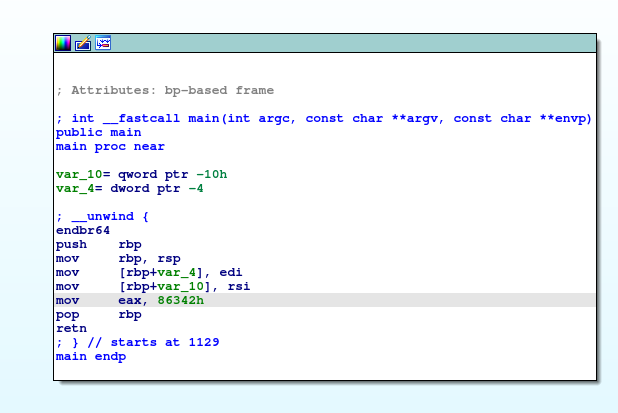

Download files:
```commandline
wget https://artifacts.picoctf.net/c/512/debugger0_a
```
Open in IDAfree:


Focus on ```mov  eax, 86342h```, the value of ```eax``` register is ```0x86432```(549698)

The flags: ```picoCTF{549698}```

Using ```gdb```:

```
┌──(stupidhacker㉿kali)-[~/Downloads/pico/tmp]
└─$ gdb debugger0_a                                                 
GNU gdb (Debian 13.2-1) 13.2
Copyright (C) 2023 Free Software Foundation, Inc.
License GPLv3+: GNU GPL version 3 or later <http://gnu.org/licenses/gpl.html>
This is free software: you are free to change and redistribute it.
There is NO WARRANTY, to the extent permitted by law.
Type "show copying" and "show warranty" for details.
This GDB was configured as "x86_64-linux-gnu".
Type "show configuration" for configuration details.
For bug reporting instructions, please see:
<https://www.gnu.org/software/gdb/bugs/>.
Find the GDB manual and other documentation resources online at:
    <http://www.gnu.org/software/gdb/documentation/>.

For help, type "help".
Type "apropos word" to search for commands related to "word"...
Reading symbols from debugger0_a...
(No debugging symbols found in debugger0_a)
(gdb) info functions
All defined functions:

Non-debugging symbols:
0x0000000000001000  _init
0x0000000000001030  __cxa_finalize@plt
0x0000000000001040  _start
0x0000000000001070  deregister_tm_clones
0x00000000000010a0  register_tm_clones
0x00000000000010e0  __do_global_dtors_aux
0x0000000000001120  frame_dummy
0x0000000000001129  main
0x0000000000001140  __libc_csu_init
0x00000000000011b0  __libc_csu_fini
0x00000000000011b8  _fini
(gdb) disa
disable      disassemble  
(gdb) disassemble main
Dump of assembler code for function main:
   0x0000000000001129 <+0>:     endbr64
   0x000000000000112d <+4>:     push   %rbp
   0x000000000000112e <+5>:     mov    %rsp,%rbp
   0x0000000000001131 <+8>:     mov    %edi,-0x4(%rbp)
   0x0000000000001134 <+11>:    mov    %rsi,-0x10(%rbp)
   0x0000000000001138 <+15>:    mov    $0x86342,%eax
   0x000000000000113d <+20>:    pop    %rbp
   0x000000000000113e <+21>:    ret
End of assembler dump.
(gdb) 
```