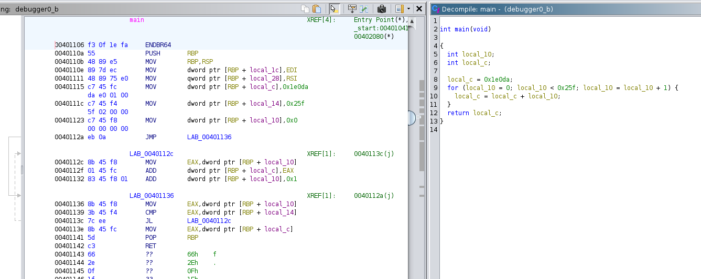
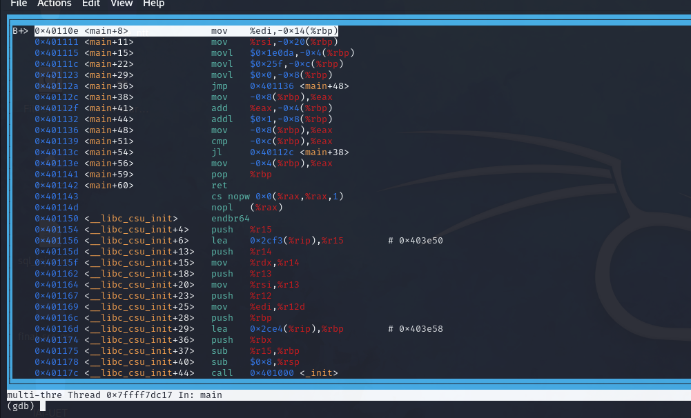
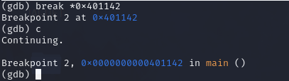
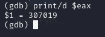

## My own solution:
> I solve it when I haven't studied about assembly and the using of ```gdb``` yet. So I decompile to C code to make it easier!!

Download file:
```commandline
wget https://artifacts.picoctf.net/c/520/debugger0_b
```
Open in ```ghidra```:

Realize that the value of ```eax``` register is ```local_c``` in the decompiled C code

The limit of for loop is ```0x25f```(307) and initialize ```local_c = 0x1ed0a```(123098)

=> ```%eax``` = ```local_c``` = ```123098 + 607*(606+0)/2``` = ```307019```

The flag is ```picoCTF{307019}```

## Using ```gdb``` (from [GDB baby step 2](https://www.stackzero.net/gdb-baby-step-2/))
Make it executable and debugger with ```gdb```:
```
┌──(stupidhacker㉿kali)-[~/Downloads/pico/tmp]
└─$ chmod +x debugger0_b
                                                                                                                                                                                                                                           
┌──(stupidhacker㉿kali)-[~/Downloads/pico/tmp]
└─$ gdb debugger0_b
GNU gdb (Debian 13.2-1) 13.2
Copyright (C) 2023 Free Software Foundation, Inc.
License GPLv3+: GNU GPL version 3 or later <http://gnu.org/licenses/gpl.html>
This is free software: you are free to change and redistribute it.
There is NO WARRANTY, to the extent permitted by law.
Type "show copying" and "show warranty" for details.
This GDB was configured as "x86_64-linux-gnu".
Type "show configuration" for configuration details.
For bug reporting instructions, please see:
<https://www.gnu.org/software/gdb/bugs/>.
Find the GDB manual and other documentation resources online at:
    <http://www.gnu.org/software/gdb/documentation/>.

For help, type "help".
Type "apropos word" to search for commands related to "word"...
Reading symbols from debugger0_b...
(No debugging symbols found in debugger0_b)
(gdb) 
```
Identify target function with 
```commandline
info functions
```
```
(gdb) info functions 
All defined functions:

Non-debugging symbols:
0x0000000000401000  _init
0x0000000000401020  _start
0x0000000000401050  _dl_relocate_static_pie
0x0000000000401060  deregister_tm_clones
0x0000000000401090  register_tm_clones
0x00000000004010d0  __do_global_dtors_aux
0x0000000000401100  frame_dummy
0x0000000000401106  main
0x0000000000401150  __libc_csu_init
0x00000000004011c0  __libc_csu_fini
0x00000000004011c8  _fini
(gdb) 
```
Disassemble the ```main``` function:
```
(gdb) disassemble main 
Dump of assembler code for function main:
   0x0000000000401106 <+0>:     endbr64
   0x000000000040110a <+4>:     push   %rbp
   0x000000000040110b <+5>:     mov    %rsp,%rbp
   0x000000000040110e <+8>:     mov    %edi,-0x14(%rbp)
   0x0000000000401111 <+11>:    mov    %rsi,-0x20(%rbp)
   0x0000000000401115 <+15>:    movl   $0x1e0da,-0x4(%rbp)
   0x000000000040111c <+22>:    movl   $0x25f,-0xc(%rbp)
   0x0000000000401123 <+29>:    movl   $0x0,-0x8(%rbp)
   0x000000000040112a <+36>:    jmp    0x401136 <main+48>
   0x000000000040112c <+38>:    mov    -0x8(%rbp),%eax
   0x000000000040112f <+41>:    add    %eax,-0x4(%rbp)
   0x0000000000401132 <+44>:    addl   $0x1,-0x8(%rbp)
   0x0000000000401136 <+48>:    mov    -0x8(%rbp),%eax
   0x0000000000401139 <+51>:    cmp    -0xc(%rbp),%eax
   0x000000000040113c <+54>:    jl     0x40112c <main+38>
   0x000000000040113e <+56>:    mov    -0x4(%rbp),%eax
   0x0000000000401141 <+59>:    pop    %rbp
   0x0000000000401142 <+60>:    ret
End of assembler dump.
```
Set a breakpoint at main function and run the code:
```
(gdb) break main
Breakpoint 1 at 0x40110e
(gdb) run
Starting program: /home/stupidhacker/Downloads/pico/tmp/debugger0_b 
[Thread debugging using libthread_db enabled]
Using host libthread_db library "/lib/x86_64-linux-gnu/libthread_db.so.1".
```
To get a clearer picture of the assembly code, set the layout to assembly using ```layout asm```:

Set another breakpoint at the end of function with ```ret``` at ```0x401142``` and continue the running:

Retrieve the value of ```eax``` register:
