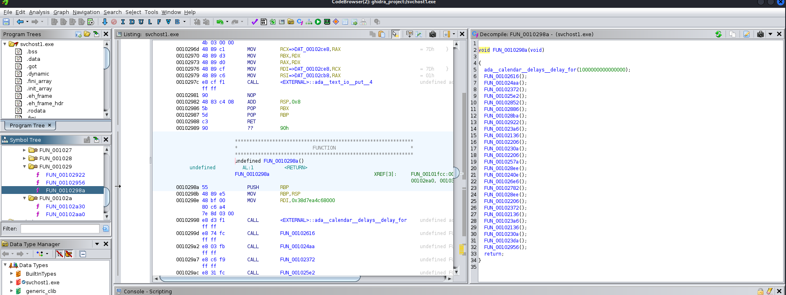

Download file:
```commandline
wget https://mercury.picoctf.net/static/7163c5d64bc60b4d079422da5c5e5053/svchost.exe
```
Open ```svchost.exe``` in ghidra:

And focus on the function ```FUN_0010298a```:
```c
void FUN_0010298a(void)

{
  ada__calendar__delays__delay_for(1000000000000000);
  FUN_00102616();
  FUN_001024aa();
  FUN_00102372();
  FUN_001025e2();
  FUN_00102852();
  FUN_00102886();
  FUN_001028ba();
  FUN_00102922();
  FUN_001023a6();
  FUN_00102136();
  FUN_00102206();
  FUN_0010230a();
  FUN_00102206();
  FUN_0010257a();
  FUN_001028ee();
  FUN_0010240e();
  FUN_001026e6();
  FUN_00102782();
  FUN_001028ee();
  FUN_00102206();
  FUN_00102372();
  FUN_00102136();
  FUN_001023a6();
  FUN_00102136();
  FUN_0010230a();
  FUN_001023da();
  FUN_00102956();
  return;
}
```
Stepping into each function appearing in this code, example ```FUN_00102616```:
```
void FUN_00102616(void)

{
  ada__text_io__put__4(&DAT_00102cd8,&DAT_00102cb8);
  return;
}
```
```
                             **************************************************************
                             *                          FUNCTION                          *
                             **************************************************************
                             undefined FUN_00102616()
             undefined         AL:1           <RETURN>
                             FUN_00102616                                    XREF[3]:     FUN_0010298a:0010299d(c), 
                                                                                          00102e18, 00103368(*)  
        00102616 55              PUSH       RBP
        00102617 48 89 e5        MOV        RBP,RSP
        0010261a 53              PUSH       RBX
        0010261b 48 83 ec 08     SUB        RSP,0x8
        0010261f 48 8d 05        LEA        RAX,[DAT_00102cd8]                               = 70h    p
                 b2 06 00 00
        00102626 48 8d 15        LEA        RDX,[DAT_00102cb8]                               = 01h
                 8b 06 00 00
        0010262d 48 89 c1        MOV        RCX=>DAT_00102cd8,RAX                            = 70h    p
        00102630 48 89 d3        MOV        RBX,RDX
        00102633 48 89 d0        MOV        RAX,RDX
        00102636 48 89 cf        MOV        RDI=>DAT_00102cd8,RCX                            = 70h    p
        00102639 48 89 c6        MOV        RSI=>DAT_00102cb8,RAX                            = 01h
        0010263c e8 0f f5        CALL       <EXTERNAL>::ada__text_io__put__4                 undefined ada__text_io__put__4()
                 ff ff
        00102641 90              NOP
        00102642 48 83 c4 08     ADD        RSP,0x8
        00102646 5b              POP        RBX
        00102647 5d              POP        RBP
        00102648 c3              RET
        00102649 90              ??         90h

```
Realizing that this function representing for the letter ```p```!!!. 
Check another function, ```FUN_00102922```:
```
void FUN_00102922(void)

{
  ada__text_io__put__4(&DAT_00102ce7,&DAT_00102cb8);
  return;
}
```
```
                             **************************************************************
                             *                          FUNCTION                          *
                             **************************************************************
                             undefined FUN_00102922()
             undefined         AL:1           <RETURN>
                             FUN_00102922                                    XREF[3]:     FUN_0010298a:001029c0(c), 
                                                                                          00102e90, 00103548(*)  
        00102922 55              PUSH       RBP
        00102923 48 89 e5        MOV        RBP,RSP
        00102926 53              PUSH       RBX
        00102927 48 83 ec 08     SUB        RSP,0x8
        0010292b 48 8d 05        LEA        RAX,[DAT_00102ce7]                               = 7Bh    {
                 b5 03 00 00
        00102932 48 8d 15        LEA        RDX,[DAT_00102cb8]                               = 01h
                 7f 03 00 00
        00102939 48 89 c1        MOV        RCX=>DAT_00102ce7,RAX                            = 7Bh    {
        0010293c 48 89 d3        MOV        RBX,RDX
        0010293f 48 89 d0        MOV        RAX,RDX
        00102942 48 89 cf        MOV        RDI=>DAT_00102ce7,RCX                            = 7Bh    {
        00102945 48 89 c6        MOV        RSI=>DAT_00102cb8,RAX                            = 01h
        00102948 e8 03 f2        CALL       <EXTERNAL>::ada__text_io__put__4                 undefined ada__text_io__put__4()
                 ff ff
        0010294d 90              NOP
        0010294e 48 83 c4 08     ADD        RSP,0x8
        00102952 5b              POP        RBX
        00102953 5d              POP        RBP
        00102954 c3              RET
        00102955 90              ??         90h
```
This function represents for the character ```{```

When checking other functions, we have the similar results. After some manual steps, I changed all the name of these functions:
```
void focus_this_function(void)

{
  ada__calendar__delays__delay_for(1000000000000000);
  p_func();
  i_func();
  c_func();
  o_func();
  C_func();
  T_func();
  F_func();
  openbracket_func();
  d_func();
  1_func();
  5_func();
  a_func();
  5_func();
  m_func();
  __func();
  f_func();
  t_func();
  w_func();
  __func();
  5_func();
  c_func();
  1_func();
  d_func();
  1_func();
  a_func();
  e_func();
  closebracket_func();
  return;
}
```
The flag: ```picoCTF{d15a5m_ftw_5c1d1ae}```
